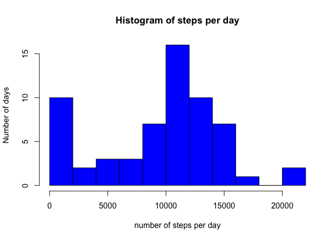
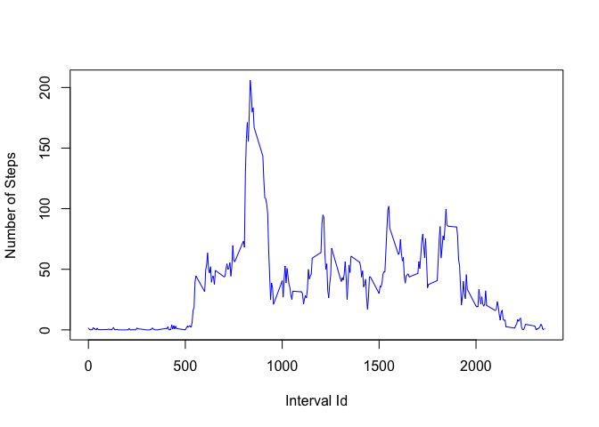
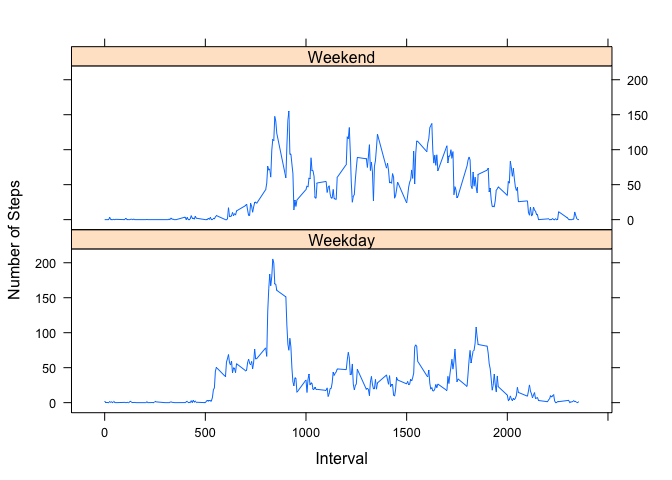

# Reproducible Research: Peer Assessment 1


## Loading and preprocessing the data
The data is already included in this directory in a zip format. We will proceed to unzip and load the data by typing the following commands in R:

```r
unzip(zipfile='activity.zip')
activity <- read.csv('activity.csv')
```
Let's print a summary of the data to have an idea of how it is organized and the magnitude of the values

```r
summary(activity)
```

```
##      steps                date          interval     
##  Min.   :  0.00   2012-10-01:  288   Min.   :   0.0  
##  1st Qu.:  0.00   2012-10-02:  288   1st Qu.: 588.8  
##  Median :  0.00   2012-10-03:  288   Median :1177.5  
##  Mean   : 37.38   2012-10-04:  288   Mean   :1177.5  
##  3rd Qu.: 12.00   2012-10-05:  288   3rd Qu.:1766.2  
##  Max.   :806.00   2012-10-06:  288   Max.   :2355.0  
##  NA's   :2304     (Other)   :15840
```


## What is mean total number of steps taken per day?
To get a histogram of the total number of steps per day, we will add the number of steps on each day.

```r
steps <- tapply(activity$steps, activity$date, FUN=sum, na.rm=TRUE)
hist(steps, breaks=10, xlab='number of steps per day', ylab='Number of days',main='Histogram of steps per day', col='blue')
```

 

The mean number of steps per day is ```mean(steps, na.rm=TRUE)``` = 9354.2295082, and its median is ```median(steps, na.rm=TRUE)``` = 10395.


## What is the average daily activity pattern?
Let us get the average daily activity by taking the average number of steps of every 5-minute interval. The we can get a plot of this data.


```r
avgs <- aggregate(x=list(steps=activity$steps), by=list(interval=activity$interval), FUN=mean, na.rm=TRUE)
plot(avgs,type='l',xlab='Interval Id',ylab='Number of Steps',col='blue')
```

 

We can see that the interval in which, in average, the subject was most active was the interval number: ```avgs$interval[which.max(avgs$steps)]``` = ``835``

## Inputing missing values
In order to know how many missing values are we use function ```is.na``` as follows:

```r
nas <- is.na(activity$steps)
```
So, we have a total number of ```sum(nas)``` = ``2304`` NA's.

We will fill the missing values using the median value of the number of steps by 5-minute intervals, so that we will compute the median value per 5-minute interval in the same way we did for the average value. Then we will copy the original data into a new_data data frame in order to fill the missing values. The position of missing values are given by the ```which``` function apply on our ```nas``` variable.


```r
meds <- aggregate(x=list(steps=activity$steps), by=list(interval=activity$interval), FUN=median, na.rm=TRUE)

new_data <- activity
for (i in which(nas)){
    new_data$steps[i] = meds$steps[which(meds$interval==new_data$interval[i])]
}
```

We will repeat the histogram we used before using the new data.

```r
steps2 <- tapply(new_data$steps, new_data$date, FUN=sum, na.rm=TRUE)
hist(steps2, breaks=10, xlab='number of steps per day', ylab='Number of days',main='Histogram of steps per day without NA\'s', col='blue')
```

 

The mean number of steps per day is ```mean(steps2, na.rm=TRUE)``` = 9503.8688525, and its median is ```median(steps2, na.rm=TRUE)``` = 10395.
To compare the new_data with the original data, let us print a summary of each:

```r
summary(steps)
```

```
##    Min. 1st Qu.  Median    Mean 3rd Qu.    Max. 
##       0    6778   10400    9354   12810   21190
```

```r
summary(steps2)
```

```
##    Min. 1st Qu.  Median    Mean 3rd Qu.    Max. 
##      41    6778   10400    9504   12810   21190
```
As we can see the differences rely on the fact that the default minimun (where NA's were present) was 0, while for the case of complete data, this value rises to 41, affecting the whole data set.

## Are there differences in activity patterns between weekdays and weekends?
Let us divide the data into factors, to do so, we run the following code:

```r
new_data$dayfactor <- as.factor(ifelse(weekdays(as.Date(new_data$date)) %in% c("Saturday","Sunday"), "Weekend", "Weekday"))
```
Now, new_data contains another variable named ```dayfactor```. We can repeat the lines to compute the averages but including now the factor variable. Then let us see a plot of the resulting data.

```r
avgs2 <- aggregate(x=list(steps=new_data$steps), by=list(interval=new_data$interval, factor=new_data$dayfactor), FUN=mean)
library(lattice)
xyplot(avgs2$steps ~ avgs2$interval | avgs2$factor, type='l',layout=c(1,2),xlab='Interval',ylab='Number of Steps')
```

 

To quantify differences, let us see the summary of each dataset:

```r
tapply(avgs2$steps,avgs2$factor,FUN=summary)
```

```
## $Weekday
##    Min. 1st Qu.  Median    Mean 3rd Qu.    Max. 
##   0.000   1.922  20.780  31.150  45.930 205.400 
## 
## $Weekend
##     Min.  1st Qu.   Median     Mean  3rd Qu.     Max. 
##   0.0000   0.9688  28.1600  38.1900  67.9400 155.0000
```
According to these numbers, we can say that the subject is slightly more active on the weekends than on weekdays since the number of steps do not vary as much as in weekdays.
